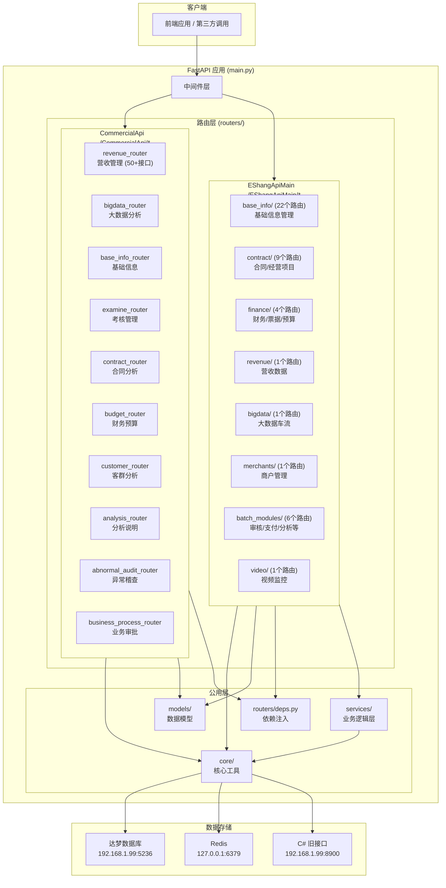
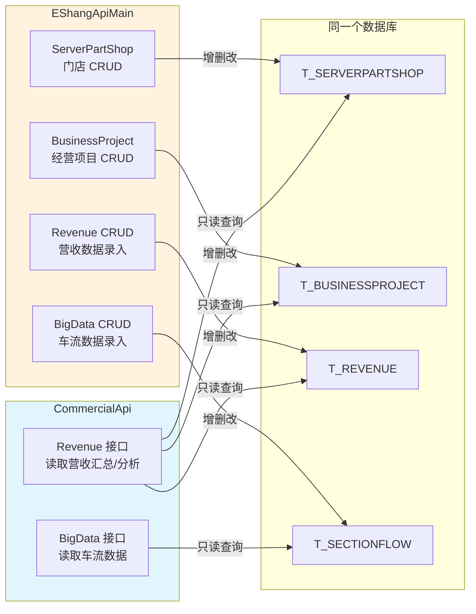
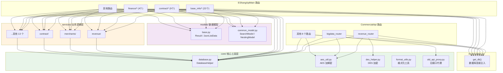
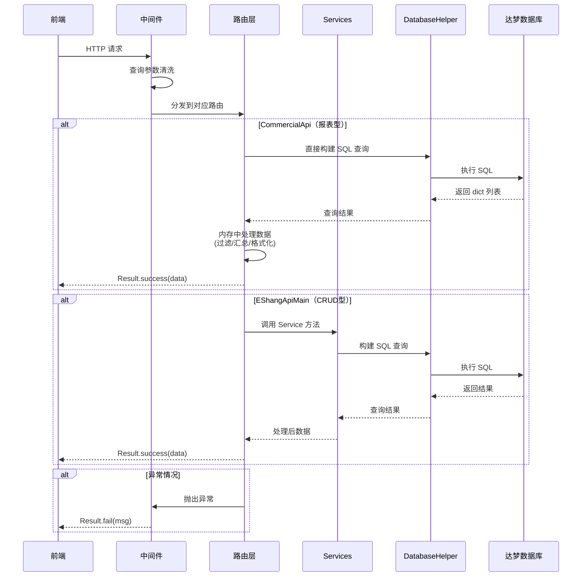
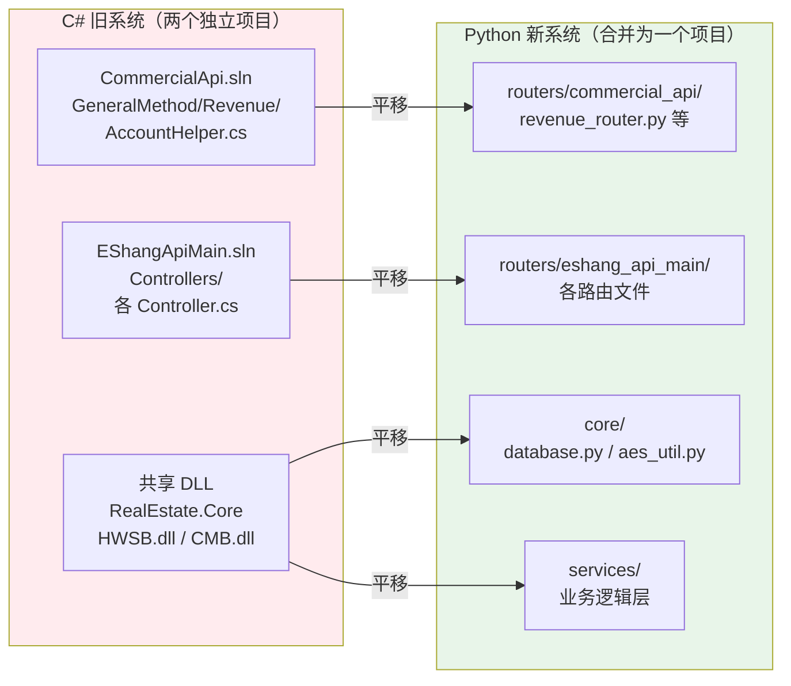

# NewPython-Host 项目逻辑架构

---

## 一、整体架构图



---

## 二、两个模块的关系

### 2.1 是否有穿插？

> [!IMPORTANT]
> **两个模块之间没有直接代码引用**。`CommercialApi` 不 import `EShangApiMain` 的任何内容，反之亦然。

它们是**完全独立的两套路由**，对应 C# 旧系统中两个独立的 Web API 项目：

| 维度 | CommercialApi | EShangApiMain |
|------|--------------|---------------|
| **C# 原项目** | CommercialApi.sln | EShangApiMain.sln |
| **路由前缀** | `/CommercialApi/*` | `/EShangApiMain/*` |
| **路由文件数** | 11 个 | 45+ 个 |
| **代码量** | ~750KB（revenue_router 独占 420KB） | ~300KB |
| **业务定位** | 经营看板/报表/分析（只读为主） | CRUD 数据管理（增删改查） |
| **接口风格** | 大量复杂聚合查询，多表关联 | 标准 CRUD，单表操作为主 |
| **services 使用** | ❌ 不使用（逻辑内嵌在 router） | ✅ 使用 services 层 |

### 2.2 关联点

虽然代码不直接引用，但两个模块在**业务数据层面有关联**：



**总结**: EShangApiMain 负责**数据的写入和管理**，CommercialApi 负责**数据的汇总分析和展示**。两者通过共享的数据库表产生间接关联。

---

## 三、公用方法详解

### 3.1 公用层全景



### 3.2 各公用模块说明

| 公用模块 | 文件 | 功能 | CommercialApi 使用 | EShangApiMain 使用 |
|---------|------|------|-------------------|-------------------|
| **DatabaseHelper** | `core/database.py` | 达梦数据库连接池、查询封装、事务管理 | ✅ 所有路由 | ✅ 所有路由 |
| **AES 加解密** | `core/aes_util.py` | POST 请求体 AES 解密（`decrypt_post_data`） | ✅ 多个路由 | ❌ |
| **DES 加密** | `core/des_helper.py` | `MERCHANTS_ID` 等敏感 ID 加密（`des_encrypt_id`） | ✅ revenue_router | ❌ |
| **格式化工具** | `core/format_utils.py` | 日期、数值格式化 | ✅ | ✅ |
| **旧接口代理** | `core/old_api_proxy.py` | 未平移接口透传到 C# 旧服务 | ✅ budget_router | ❌ |
| **Result 模型** | `models/base.py` | 统一响应格式 `Result.success/fail`、分页 `JsonListData` | ✅ 所有路由 | ✅ 所有路由 |
| **SearchModel** | `models/common_model.py` | POST 搜索请求体模型（分页+排序+条件） | ❌ | ✅ 大部分路由 |
| **get_db()** | `routers/deps.py` | FastAPI 依赖注入，获取数据库连接 | ✅ 所有路由 | ✅ 所有路由 |
| **services 层** | `services/` | 业务逻辑封装（CRUD 操作） | ❌ 不使用 | ✅ 所有路由 |

### 3.3 两个模块的设计差异

```
CommercialApi（报表分析型）:
  路由文件 → 直接写 SQL + 业务逻辑 → core/database.py → DB
  特点: 大函数、复杂 SQL、多表关联、逻辑内嵌
  原因: C# 原实现也是 Controller 中直接写 SQL（AccountHelper 静态方法）

EShangApiMain（CRUD 管理型）:
  路由文件 → services/ 业务层 → core/database.py → DB
  特点: 标准 CRUD、单表操作、逻辑分层
  原因: 更早期平移，采用了分层架构
```

---

## 四、数据流向



---

## 五、C# 原项目对照



| C# 原始 | Python 对应 | 说明 |
|---------|------------|------|
| `AccountHelper.cs` 静态方法 | `revenue_router.py` 函数内嵌逻辑 | 1:1 平移，保持同样的 SQL 和处理逻辑 |
| `HWSB.SERVERPARTSHOP` ORM 类 | `services/base_info/` + 原生 SQL | ORM → 原生 SQL |
| `CMB.AUTOSTATISTICS.GetSubType()` | `revenue_router.py` 内嵌递归展开 | 公用方法变内联 |
| `RealEstate_System.ToDecrypt()` | `core/des_helper.py` | 加解密工具 |
| `Web.config` | `config.py` + `.env` | 配置管理 |
